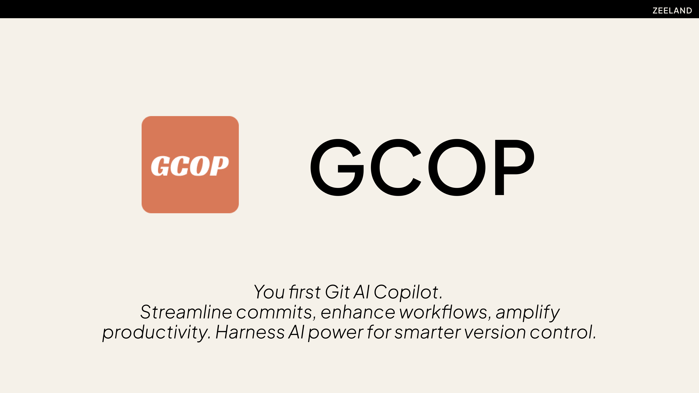

<div align="center">

[](https://pypi.org/project/gcop/)
[](https://github.com/Undertone0809/gcop/pulls?utf8=%E2%9C%93&q=is%3Apr%20author%3Aapp%2Fdependabot)
[](https://github.com/Undertone0809/gcop/releases)
[](https://github.com/Undertone0809/gcop/blob/main/LICENSE)

<a href="https://t.me/zeeland0809" target="_blank">
    
</a>

</div>

Gcop is your git AI copilot. You can use any large language model to help automate the generation of commit messages.

## Features

- Generate commit messages by large language models.
- Easily config your language model.

## TECH

- [Promptulate: Large language model automation and Autonomous Language Agents development framework](https://github.com/Undertone0809/promptulate)
- [P3G: Python Packages Project Generator](https://github.com/Undertone0809/P3G)
- [Gamma: Generate gcop Banner here](https://gamma.app/)
- [gpt-4o: Generate project code](https://openai.com/)

## Video Demo

[](https://www.youtube.com/watch?v=j7qKI_TdhXs "Gcop is your git AI copilot")

## Quick Start

- Install gcop

```shell
pip install gcop
```

- If you are first time to use gcop, you need to run the `gcop init` command to initialize the configuration. This command will alias gcop command on your git.

```shell
gcop init
```

## Basic Usage

Run the `git ghelp` command to get help information and show all gcop commands.

```shell
gcop is your local git command copilot
Version: 1.0.0
GitHub: https://github.com/Undertone0809/gcop


Usage: git [OPTIONS] COMMAND
Commands:
  git ghelp      Add command into git config
  git gconfig    Open the config file in the default editor
  git gcommit    Generate a git commit message based on the staged changes and commit the changes
```

> gcop continues to add git gxxx commands later.

### Config your language model

Before you generate a commit message, you need to config your language model. You can use any large language model to generate commit messages. The following example shows how to config the language model.

```shell
git gconfig
```

Then gcop will generate a `config.yaml`, then you can config your language model.`config.yaml` store path:

- Windows: `%USERPROFILE%\.gcop\config.yaml`
- Linux: `~/.gcop/config.yaml`
- MacOS: `~/.gcop/config.yaml`

Config your model in `config.yaml`, see how to config your model [here](./docs/how-to-config-model.md):

```yaml
model:
  model_name: provider/name,eg OpenAI/gpt-4
  api_key: YOUR_API_KEY
```

### Generate commit message

The following example show how to use gcop to generate a commit message. 

```shell
git add .
git gcommit
```

## Video Demo

This video shows how to use gcop to generate a commit message.

[](https://www.youtube.com/watch?v=j7qKI_TdhXs "Gcop is your git AI copilot")

## Development

Conda package manager is recommended. Create a conda environment.

```bash
conda create -n gcop python==3.10
```

Activate conda environment and install poetry

```bash
conda activate gcop
pip install poetry
```

Then you can run the client using the following command:

```bash
gcop --help
```

or with `Poetry`:

```bash
poetry run gcop --help
```

### Makefile usage

[`Makefile`](https://github.com/Undertone0809/gcop/blob/main/Makefile) contains a lot of
functions for faster development.


<details>
<summary>Install all dependencies and pre-commit hooks</summary>
<p>

Install requirements:

```bash
make install
```

Pre-commit hooks coulb be installed after `git init` via

```bash
make pre-commit-install
```

</p>
</details>

<details>
<summary>Codestyle and type checks</summary>
<p>

Automatic formatting uses `ruff`.

```bash
make polish-codestyle

# or use synonym
make formatting
```

Codestyle checks only, without rewriting files:

```bash
make check-codestyle
```

> Note: `check-codestyle` uses `ruff` and `darglint` library

</p>
</details>

<details>
<summary>Code security</summary>
<p>

> If this command is not selected during installation, it cannnot be used.

```bash
make check-safety
```

This command launches `Poetry` integrity checks as well as identifies security issues
with `Safety` and `Bandit`.

```bash
make check-safety
```

</p>
</details>

<details>
<summary>Tests with coverage badges</summary>
<p>

Run `pytest`

```bash
make test
```

</p>
</details>

<details>
<summary>All linters</summary>
<p>

Of course there is a command to run all linters in one:

```bash
make lint
```

the same as:

```bash
make check-codestyle && make test && make check-safety
```

</p>
</details>

<details>
<summary>Docker</summary>
<p>

```bash
make docker-build
```

which is equivalent to:

```bash
make docker-build VERSION=latest
```

Remove docker image with

```bash
make docker-remove
```

More
information [about docker](https://github.com/Undertone0809/python-package-template/tree/main/%7B%7B%20cookiecutter.project_name%20%7D%7D/docker).

</p>
</details>

<details>
<summary>Cleanup</summary>
<p>
Delete pycache files

```bash
make pycache-remove
```

Remove package build

```bash
make build-remove
```

Delete .DS_STORE files

```bash
make dsstore-remove
```

Remove .mypycache

```bash
make mypycache-remove
```

Or to remove all above run:

```bash
make cleanup
```

</p>
</details>

## 🛡 License

[](https://github.com/Undertone0809/gcop/blob/main/LICENSE)

This project is licensed under the terms of the `MIT` license.
See [LICENSE](https://github.com/Undertone0809/gcop/blob/main/LICENSE) for more details.

## Contact

For more information, please
contact: [zeeland4work@gmail.com](mailto:zeeland4work@gmail.com)

See anything changelog, describe the [telegram channel](https://t.me/zeeland0809)


## Credits [](https://github.com/Undertone0809/python-package-template)

This project was generated with [P3G](https://github.com/Undertone0809/P3G)
